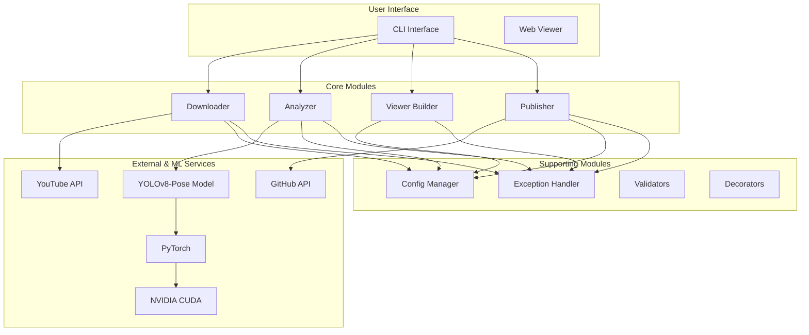

# FlowState-CLI Architecture Documentation (v2.0)

## Overview

FlowState-CLI is a modern, modular Python application that transforms YouTube or local videos into interactive 3D pose analyses. This document describes the refactored architecture, which is built around a high-performance, GPU-accelerated pose estimation pipeline.

## System Architecture

The architecture is designed for modularity and performance, leveraging a containerized environment for reproducibility.



## Module Structure

### Core Modules (`src/core/`)

#### 1. **Downloader** (`downloader.py`)
- Handles video download from YouTube using `yt-dlp`.
- Manages temporary storage and frame extraction using `OpenCV`.
- Implements retry logic and handles various video formats.

#### 2. **Analyzer** (`analyzer.py`)
- **The core of the new system.** Uses a **YOLOv8-Pose** model for high-quality pose estimation.
- Implements an **OpenPose-compatible** output, including keypoints for **body, hands, feet, and face**.
- Runs on **PyTorch** and is accelerated by **NVIDIA CUDA**.
- Performs **temporal interpolation** to increase frame data by **10x**.
- Applies **motion smoothing** algorithms to reduce jitter and create fluid animations.
- Calculates advanced metrics: flow, balance, smoothness, and energy.

#### 3. **Publisher** (`publisher.py`)
- Manages GitHub repository creation and file uploads via the GitHub API.
- Enables and verifies GitHub Pages deployment.

#### 4. **Config** (`config.py`)
- Centralized configuration using Pydantic for type-safe settings.
- Manages environment variables, including new OpenPose-specific settings.

#### 5. **Exceptions** (`exceptions.py`)
- Custom, hierarchical exception classes for robust error handling.

### CLI Module (`src/cli/`)

#### **App** (`app.py`)
- A user-friendly CLI interface built with `Click`.
- Provides rich console output, progress bars, and clear error messages.

### Viewer Module (`src/viewer/`)

#### **Builder** (`builder.py`)
- Generates a static HTML/JS/CSS site for the 3D viewer.
- Injects the JSON output from the analyzer into the viewer template.

### Utility Modules (`src/utils/`)

- **Validators** (`validators.py`): Functions for validating inputs like URLs and tokens.
- **Decorators** (`decorators.py`): Reusable decorators for caching, retries, and timing.

## Data Flow

1.  **Video Input**: A YouTube URL or local file path is passed to the `Downloader`. It fetches the video and extracts frames into a temporary directory.
    ```
    Input (URL/File) → Downloader → Frames
    ```

2.  **Pose Analysis (GPU-Accelerated)**: The `Analyzer` processes each frame.
    - The YOLOv8-Pose model, running on PyTorch with CUDA, detects keypoints.
    - The raw keypoints are structured into an OpenPose-compatible format (body, hands, face).
    - The sequence of pose data is interpolated and smoothed.
    - Final metrics are calculated.
    ```
    Frames → YOLOv8-Pose → Raw Keypoints → Interpolation & Smoothing → Final Pose Data (JSON)
    ```

3.  **Visualization**: The `Viewer Builder` takes the final JSON data and injects it into the web viewer template.
    ```
    Pose Data (JSON) + Viewer Template → Static Site (HTML/JS/CSS)
    ```

4.  **Publishing**: The `Publisher` pushes the static site to a GitHub repository and enables GitHub Pages.
    ```
    Static Site → GitHub API → GitHub Pages
    ```

## Key Design Decisions

### 1. **YOLOv8-Pose as the Core Engine**
- **Why?** YOLOv8-Pose offers a state-of-the-art balance of speed and accuracy, outperforming many traditional models. While we refer to the output as "OpenPose-compatible" for its rich, full-body keypoint structure, the underlying engine is YOLO.
- **Benefit**: This provides superior detection of hands and feet and better performance in challenging video conditions.

### 2. **Containerization with NVIDIA Docker**
- **Why?** The complex dependency chain (CUDA, cuDNN, PyTorch, OpenCV) is notoriously difficult to manage manually. Docker provides a reproducible, isolated environment.
- **Benefit**: Users can run the application with a single `docker-compose` command without worrying about system-level dependencies.

### 3. **Temporal Interpolation and Smoothing**
- **Why?** Standard video frame rates (e.g., 30 FPS) can result in "twitchy" animations.
- **Benefit**: By synthetically increasing the frame rate and smoothing the motion between keypoints, we create a much more fluid and realistic visualization of the movement.

### 4. **Pydantic for Configuration**
- **Why?** Provides robust, type-safe configuration management.
- **Benefit**: Prevents common errors from misconfigured settings and allows for easy extension with new parameters.

## Current Implementation Status

-   **Hand and Face Detection**: The `analyzer.py` module includes methods (`_detect_hands`, `_detect_face`) that are currently **stubs**. They generate synthetic data based on wrist and head positions rather than using a dedicated detection model. This provides the correct data structure for the viewer but does not reflect true hand or face articulation.
-   **Motion Smoothing**: The smoothing algorithm (`_gaussian_smooth_pose`) is a placeholder and returns the original, unsmoothed data. A more sophisticated filter (e.g., Gaussian or Kalman) is needed to reduce jitter effectively.
-   **Batch Processing**: While the architecture is designed for batch processing, the current implementation processes frames one by one.

## Performance and Security

### Performance
- **Multi-stage Docker Build**: Creates a minimal final image, reducing size and improving startup time.
- **GPU Offloading**: All heavy computation (pose estimation) is offloaded to the NVIDIA GPU, freeing up CPU resources.
- **Batch Processing**: The analyzer is designed to process frames in batches for optimal GPU utilization (future enhancement).

### Security
- **Non-Root Container**: The Docker container runs as a non-root user to minimize security risks.
- **Read-Only Mounts**: Input data is mounted as read-only to prevent accidental modification.
- **Token Handling**: The GitHub token is handled securely via environment variables and is never stored in the container or logs.

---

*Architecture designed and documented for FlowState v2.0.*