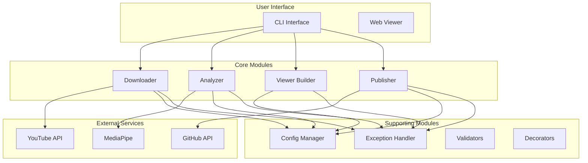

# FlowState-CLI Architecture Documentation

## Overview

FlowState-CLI is a modern, modular Python application that transforms YouTube Tai Chi videos into interactive 3D analyses. This document describes the refactored architecture following migration by the ruv-swarm agent network.

## System Architecture



## Module Structure

### Core Modules (`src/core/`)

#### 1. **Downloader** (`downloader.py`)
- Handles YouTube video download using yt-dlp
- Extracts frames at configurable FPS
- Manages temporary storage
- Implements retry logic with exponential backoff

#### 2. **Analyzer** (`analyzer.py`)
- Uses MediaPipe for pose detection
- Calculates Tai Chi-specific metrics:
  - Flow score (weighted combination)
  - Balance (center of mass stability)
  - Smoothness (velocity consistency)
  - Energy (controlled movement)
- Handles edge cases gracefully

#### 3. **Publisher** (`publisher.py`)
- Manages GitHub repository creation
- Handles file uploads via API
- Enables GitHub Pages
- Validates deployment success

#### 4. **Config** (`config.py`)
- Centralized configuration using Pydantic
- Environment variable support
- Type validation
- Default values with overrides

#### 5. **Exceptions** (`exceptions.py`)
- Hierarchical exception structure
- Specific error types for each module
- Rich error details
- User-friendly messages

### CLI Module (`src/cli/`)

#### **App** (`app.py`)
- Click-based CLI interface
- Rich console output with progress bars
- Interactive wizards
- Error handling and recovery

### Viewer Module (`src/viewer/`)

#### **Builder** (`builder.py`)
- Generates static site from React build
- Injects pose data into pre-built viewer
- Optimizes for deployment

### Utility Modules (`src/utils/`)

#### 1. **Validators** (`validators.py`)
- Input validation functions
- URL format checking
- Token validation
- Data integrity checks

#### 2. **Decorators** (`decorators.py`)
- Retry with exponential backoff
- Performance timing
- Input validation
- Path existence checking
- Simple caching

## Data Flow

1. **Video Input**
   ```
   YouTube URL → Downloader → Video File → Frame Extraction
   ```

2. **Pose Analysis**
   ```
   Frames → MediaPipe → Landmarks → Metrics Calculation → Pose Data
   ```

3. **Visualization**
   ```
   Pose Data + Video Info → Viewer Builder → Static Site
   ```

4. **Publishing**
   ```
   Static Site → GitHub API → Repository → GitHub Pages
   ```

## Key Design Decisions

### 1. **MediaPipe vs YOLOv8**
- Chose MediaPipe for better 3D landmark support
- More suitable for human pose estimation
- Better performance on Tai Chi movements
- Includes visibility confidence scores

### 2. **Unified Viewer Architecture**
- Single React-based viewer
- Pre-built during Docker image creation
- Data injection at runtime
- Reduced complexity and maintenance

### 3. **Configuration Management**
- Pydantic for validation
- Environment variables for flexibility
- Sensible defaults
- Type safety throughout

### 4. **Error Handling Strategy**
- Custom exception hierarchy
- Graceful degradation
- User-friendly messages
- Debug mode for developers

### 5. **Security Considerations**
- Token never persisted
- Input validation at boundaries
- Sanitized file paths
- HTTPS-only communications

## Performance Optimizations

1. **Docker Multi-stage Build**
   - Separate build and runtime stages
   - Minimal final image size
   - Cached layer optimization

2. **Frame Processing**
   - Configurable frame extraction rate
   - Trimmed mean for metric calculation
   - Early termination on failure

3. **Memory Management**
   - Stream processing for large videos
   - Cleanup after processing
   - Bounded frame buffer

## Testing Strategy

### Unit Tests
- Individual module testing
- Mock external dependencies
- Edge case coverage

### Integration Tests
- Full pipeline testing
- Real MediaPipe integration
- File system operations

### Performance Tests
- Processing speed benchmarks
- Memory usage monitoring
- Docker build optimization

## Future Extensibility

### Plugin Architecture
```python
class AnalyzerPlugin(ABC):
    @abstractmethod
    def analyze(self, frame: np.ndarray) -> Dict:
        pass

class PoseDetectorPlugin(ABC):
    @abstractmethod
    def detect(self, frame: np.ndarray) -> List[Landmark]:
        pass
```

### Additional Analyzers
- Form correction suggestions
- Movement pattern recognition
- Multi-person support
- Real-time streaming

### Deployment Targets
- AWS S3 + CloudFront
- Netlify
- Vercel
- Self-hosted options

## Monitoring and Observability

### Logging
- Structured logging with context
- Log levels based on environment
- Performance metrics logging

### Metrics
- Processing time per stage
- Success/failure rates
- Resource utilization

### Health Checks
- Docker health endpoint
- Dependency verification
- Model loading status

## Security Model

### Input Validation
- URL format validation
- File type verification
- Size limits enforcement

### API Security
- Token scope validation
- Rate limiting preparation
- Secure credential handling

### Output Sanitization
- Path traversal prevention
- HTML escaping
- JSON validation

---

*Architecture designed and implemented by ruv-swarm migration team*